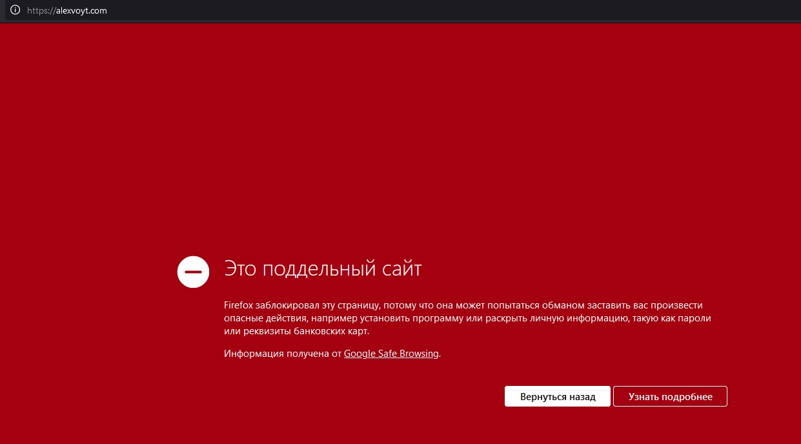

# Phishing

## Server/domain setup

## Mails

<table>
	<thead>
	<tr>
		<th>Login</th>
		<th>Password</th>
	</tr>
	</thead>
	<tbody>
	<tr>
		<td colspan="2" style="text-align: center">yandex.ru</td>
	</tr>
	<tr>
		<td>jasonkorner899</td>
		<td>as9uHBesap20</td>
	</tr>
	<tr>
		<td>kvarimatas</td>
		<td>L6gYvh6XhsPpUNL</td>
	</tr>
	<tr>
		<td>msavateev46</td>
		<td>L6gYvh6XhsPpUNL</td>
	</tr>
	<tr>
		<td colspan="2" style="text-align: center">gmail.com</td>
	</tr>
	<tr>
		<td>jasonkorner899</td>
		<td>as9uHBesap20</td>
	</tr>
	<tr>
		<td>kvarimatas</td>
		<td>L6gYvh6XhsPpUNL</td>
	</tr>
	<tr>
		<td>msavateev46</td>
		<td>L6gYvh6XhsPpUNL</td>
	</tr>
	<tr>
		<td colspan="2" style="text-align: center">mail.ru</td>
	</tr>
	<tr>
		<td>jasonkorner899</td>
		<td>as9uHBesap20</td>
	</tr>
	<tr>
		<td>kvarimatas</td>
		<td>L6gYvh6XhsPpUNL</td>
	</tr>
	<tr>
		<td>msavateev46</td>
		<td>L6gYvh6XhsPpUNL</td>
	</tr>
	<tr>
		<td colspan="2" style="text-align: center">outlook.com</td>
	</tr>
	<tr>
		<td>jasonkorner899</td>
		<td>as9uHBesap20</td>
	</tr>
	<tr>
		<td>kvarimatas</td>
		<td>L6gYvh6XhsPpUNL</td>
	</tr>
	<tr>
		<td>msavateev46</td>
		<td>L6gYvh6XhsPpUNL</td>
	</tr>
</table>

## Canary alert example

## Canary campaign result

<table>
	<thead>
	<tr>
		<th>Mail</th>
		<th>In spam</th>
	</tr>
	</thead>
	<tbody>
	<tr>
		<td>Yandex</td>
		<td>No</td>
	</tr>
	<tr>
		<td>Gmail</td>
		<td>No</td>
	</tr>
	<tr>
		<td>Mail</td>
		<td>No</td>
	</tr>
  <tr>
		<td>Outlook</td>
		<td>Yes</td>
	</tr>
</table>

## Phishing campaign sumbit data problems

## Phishing campaign result

<table>
	<thead>
	<tr>
		<th>Mail</th>
		<th>In spam</th>
	</tr>
	</thead>
	<tbody>
	<tr>
		<td>Yandex</td>
		<td>No</td>
	</tr>
	<tr>
		<td>Gmail</td>
		<td>No</td>
	</tr>
	<tr>
		<td>Mail</td>
		<td>No</td>
	</tr>
  <tr>
		<td>Outlook</td>
		<td>No</td>
	</tr>
</table>

## KEKW

